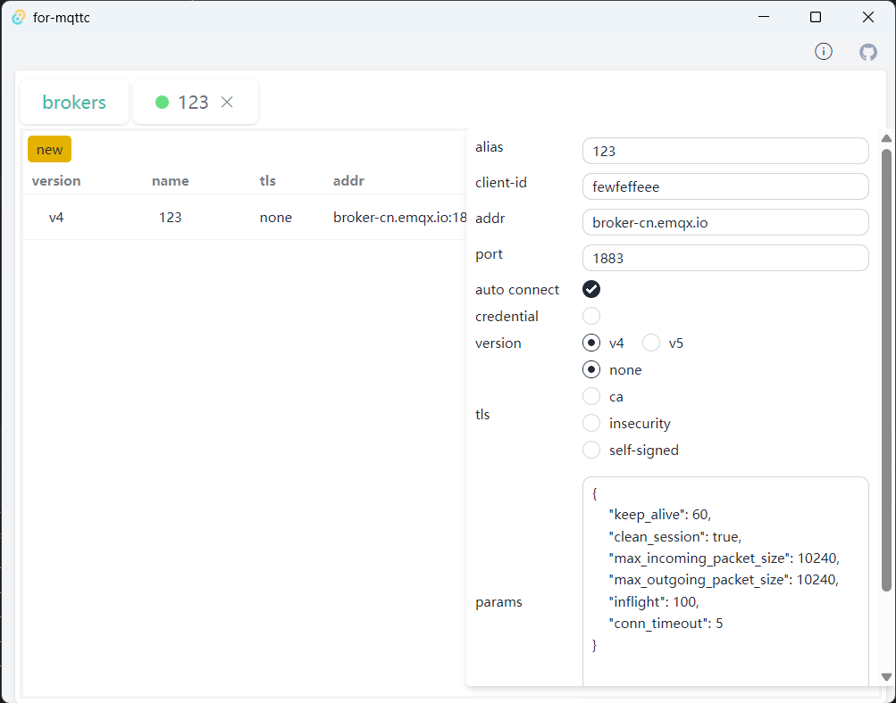
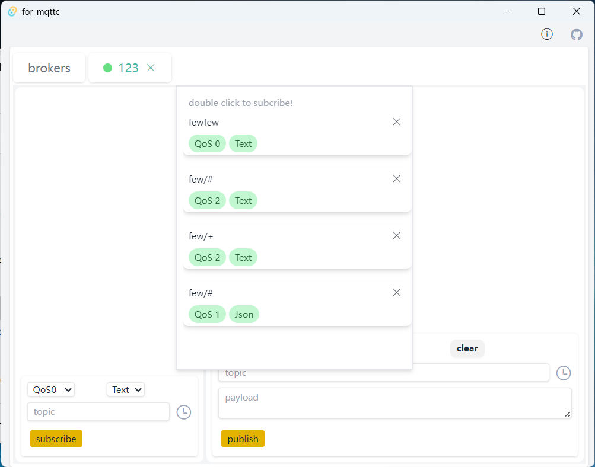

# for-mqttc

This desktop program serves as an MQTT client, crafted using Tauri and styled with Tailwind and DaisyUI. It offers streamlined features for connecting, subscribing, and publishing via MQTT, enhancing the development and testing experience for users. Designed with user convenience in mind, detailed instructions can be found in a tooltip located at the program's top right corner.

Support function:
1. protocal version: v3(v4),v5
2. tls server auth
3. tls client auth
# screenshot

